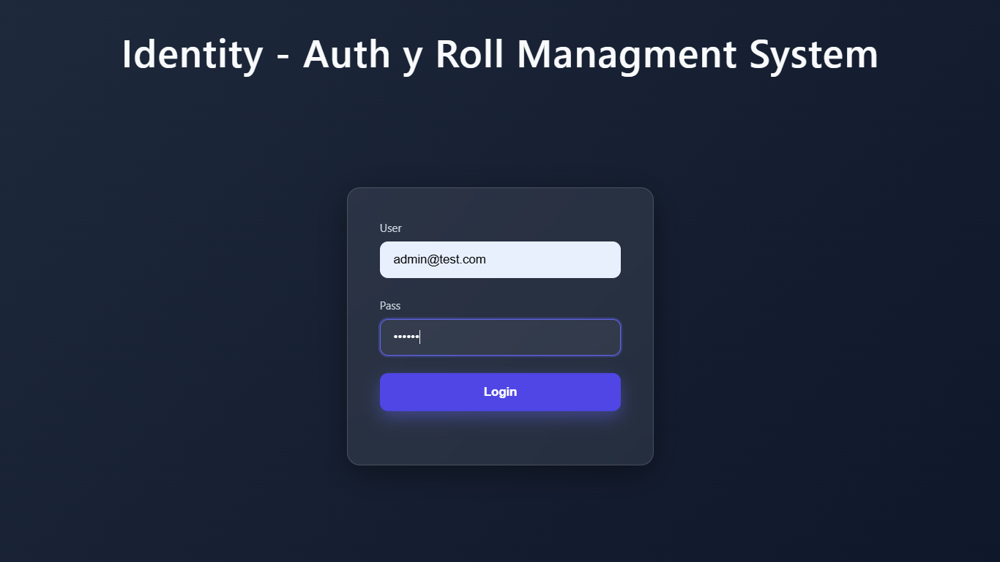

# 🧠 Identity — User & Role Management System
Sistema de autenticación y autorización basado en Supabase Auth + perfiles + roles, diseñado como backend para aplicaciones modernas.

Este proyecto implementa una arquitectura real de identidad, separando:

- Autenticación (email, password, JWT) → Supabase
- Autorización y perfiles (roles, permisos, datos) → Base de datos propia.

## 🎯 Objetivo
Construir un sistema de usuarios profesional, similar al usado por:
Firebase Auth, Auth0, Clerk o Cognito, donde:
- Supabase gestiona la seguridad y autenticación.
- La aplicación define los permisos y roles.

## 🧩 Arquitectura
```
Frontend
   │  email + password
   ▼
Backend (Express API)
   │
   ▼
Supabase
 ├─ auth.users   → credenciales, tokens, seguridad
 └─ public.users → perfil, roles, permisos
```

## 🖼️ Insertar imagen (/imgs/login.png)

- Markdown (README en GitHub o docs):
```markdown
        # ruta absoluta desde la raíz del sitio
         # ruta relativa (usa ./imgs/... según ubicación del archivo)
```

- HTML (frontend):
```html
<!-- ruta absoluta desde la raíz pública del servidor -->


<!-- ruta relativa según estructura de archivos -->

```

- Nota sobre servir archivos estáticos (Express):
```js
// coloca /imgs dentro de tu carpeta pública (ej. /public/imgs/login.png)
app.use(express.static(path.join(__dirname, 'public')))
```

- Consejos:
1. En producción, asegura que la carpeta que contiene imgs esté expuesta por el servidor (public).
2. Para README en GitHub usa rutas relativas si la imagen está en el repo (ej. imgs/login.png).
## 🧍‍♂️ Modelo de usuarios
1️⃣ - auth.users (Supabase)

Tabla interna manejada por Supabase que contiene:
- id (UUID)
- email
- password (hashed)
- tokens
- seguridad

No se modifica manualmente.

2️⃣ public.users (Aplicación) Tabla personalizada que contiene:
- id (UUID, FK a auth.users.id)
- username (string)
- role (string: 'admin', 'user')
- otros datos del perfil

Está vinculada con auth.users por el mismo UUID:
```
auth.users.id === public.users.id
```


## 🧩 Flujo de registro
1️⃣ El cliente envía:
```
{ "email", "password", "username" }
```
2️⃣ El backend ejecuta:
```
supabase.auth.admin.createUser()
```
3️⃣ Supabase:
- Hashea la contraseña
- Guarda el usuario en ```auth.users```.

4️⃣ El backend crea el perfil en ```public.users``` con el mismo UUID:
```
public.users (id = UUID, username, role)
```
5️⃣ El usuario queda listo para autenticarse.

## 🔐 Flujo de login y Autenticación

1️⃣ El cliente envía:
```
{
  "email": "user@email.com",
  "password": "123456"
}
```
2️⃣ El backend ejecuta:
```
supabase.auth.signInWithPassword()
```
3️⃣ Supabase:
- Verifica credenciales
- Valida la contraseña (hash)
- Devuelve JWT (access + refresh)
- Devuelve el perfil del usuario (id, email).

4️⃣ El backend recibe:
```
{
  "access_token": "...",
  "refresh_token": "...",
  "user": {
    "id": "...",
    "email": "...",
    "username": "...",
    "role": "admin"
  }
}
```
El access_token se usa para autenticar futuras solicitudes, y el refresh_token para obtener nuevos tokens cuando el access_token expire.

5️⃣ El backend busca el perfil del usuario:
```sql
SELECT username, role
FROM public.users
WHERE id = user.id
```
6️⃣ El backend responde al frontend:
```json
{
  "access_token": "...",
  "refresh_token": "...",
  "user": {
    "id": "uuid",
    "email": "user@email.com",
    "username": "charly",
    "role": "admin"
  }
}
```
El `access_token` se usa para autenticar futuras solicitudes.

El `refresh_token` se usa para obtener nuevos tokens cuando el access_token expira.
## 🗄️ Estructura de Base de Datos (Supabase)
Tabla: ```roles```
```sql
create table roles (
  id serial primary key,
  name text unique not null
);

insert into roles (name) values ('admin'), ('user');
```

Tabla: ```public.users```
```sql
create table users (
  id uuid primary key references auth.users(id) on delete cascade,
  username text not null,
  role_id integer references roles(id),
  created_at timestamp with time zone default now()
);
```

## 🔐 Variables de entorno
En ```backend/.env```:
```
SUPABASE_URL=https://xxxx.supabase.co
SUPABASE_SERVICE_ROLE_KEY=eyJhbGciOiJIUzI1NiIs...
```
⚠️ IMPORTANTE
- Nunca expongas el SERVICE_ROLE_KEY en el frontend.

## 📁 Estructura del proyecto
```
identity/
 ├── backend/
 │   ├── controllers/
 │   ├── middleware/
 │   ├── services/
 │   ├── db/
 │   └── app.js
 │
 └── frontend/
     ├── index.html
     ├── dashboard.html
     ├── css/
     └── js/
```

## 🛠 Stack
- Supabase Auth
- Node.js (Express)
- PostgreSQL
- JavaScript (Frontend)


